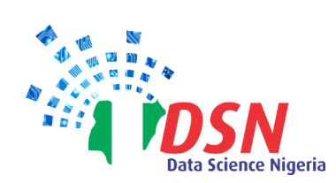

# 2019 DSN Artificial Intelligence Bootcamp

|AIBootcamp 2019|
|---|---|

AIBootcamp is a six-day residential, all-expenses-paid Artificial Intelligence Bootcamp and Hackathon on emerging trends in machine learning and deep learning. It started on Tuesday, 19 November 2019 and ended on Saturday, 23 November 2019. The intent of the bootcamp and hackathon is to build world-class capacity in advanced data analytics, upskill financial inclusion data analysts and researchers in emerging best practices, and to support the development of contextually relevant algorithm and tech innovation.
